# 
配置eclipse傻瓜式教程

## 1.下载好软件压缩包 解压（不会你学你mua的计算机）
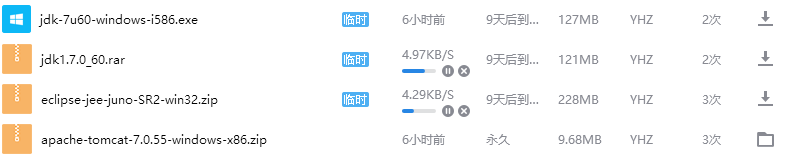
梁总你又给wifi喂屎了吧4.29kb/s的网是人用的吗
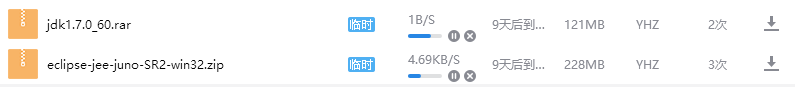
1B/s 下不了软件 全剧终
*******************************（脏话）
下软件就要啸着下 啊嘻嘻西西
我下nm

jdk的压缩包就不用装了老子不会用
## 2.安装jdk并配置环境变量
 <!-- more -->
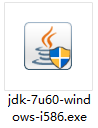

**
就是这个↑
**

直接装c盘占不了很多空间,无脑下一步就行
右击此电脑 属性 高级系统设置 坏境变量 系统变量 新建变量
变量名：`JAVA_HOME`
变量值：`C:\Program Files (x86)\Java\jdk1.7.0_60` 值为jkd安装的路径

变量名：`CLASSPATH`
变量值：`.;%JAVA_HOME%\lib\dt.jar;%JAVA_HOME%\lib\tools.jar`     //记得前面有个"."

然后用户变量
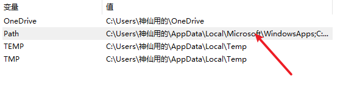
双击进去新建两条
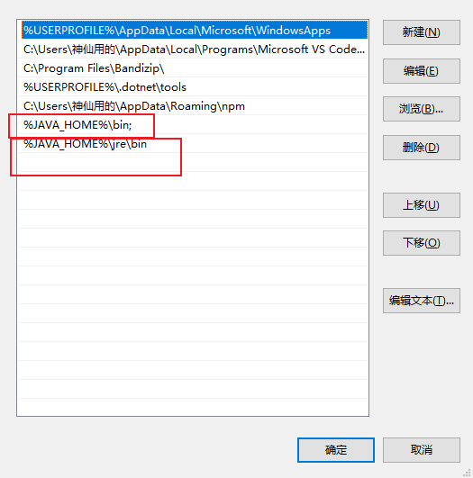
`%JAVA_HOME%\bin`
`%JAVA_HOME%\jre\bin`
然后应该就可以打开软件了，什么？你说打不开那我也不懂咯。
## 3.新建web项目
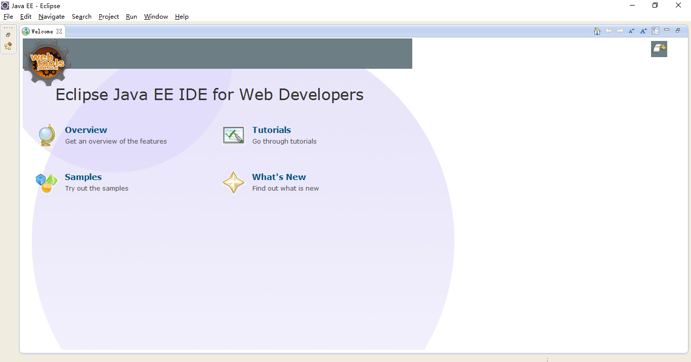
关掉欢迎界面
### 3.1配置服务器
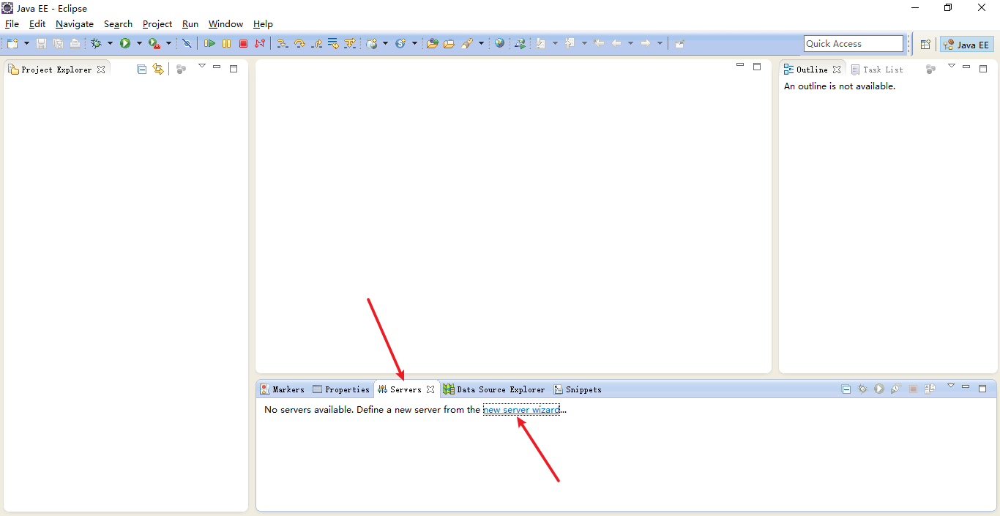
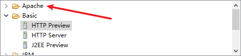
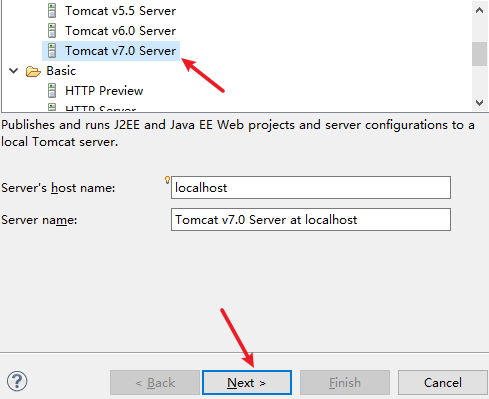
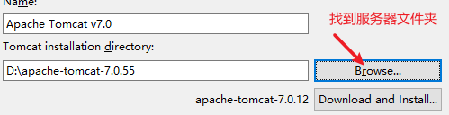
无脑下一步
### 3.2新建项目
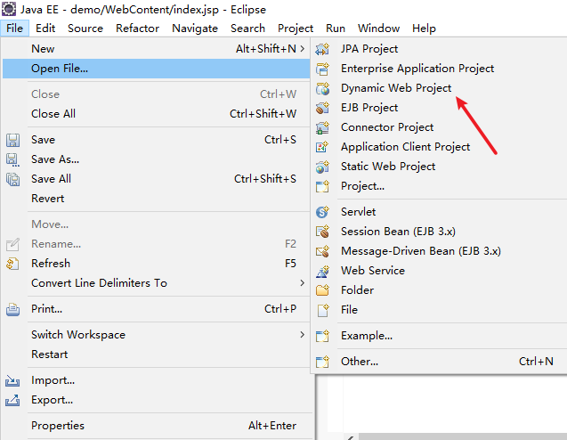
***
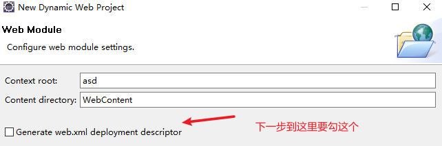
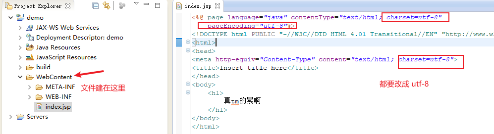
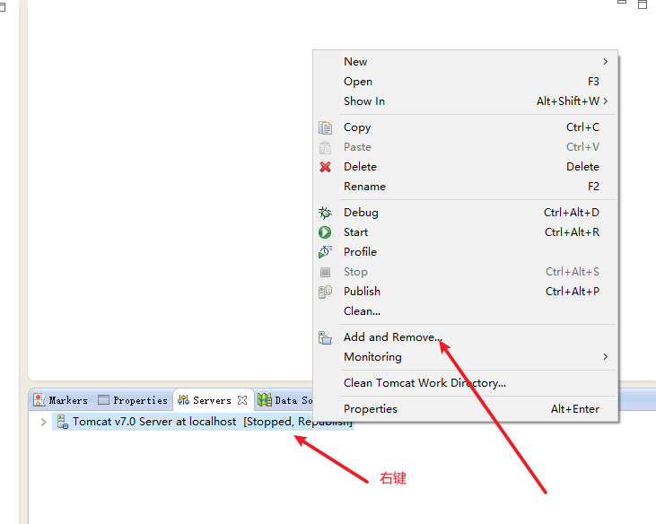
把项目添加进服务器
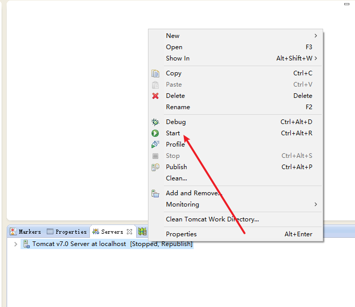
启动服务器
然后在浏览器输入网址 
`localhost:8080/dmeo/index.jsp`
dmeo是文件夹的名字 index.jsp 是文件的名字