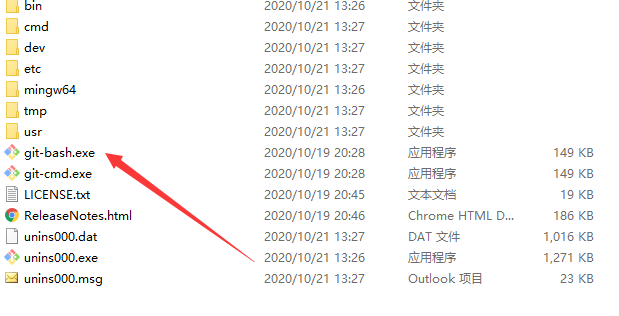
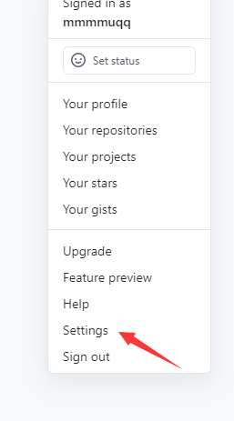
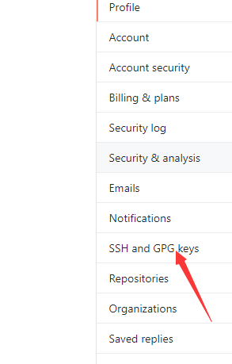
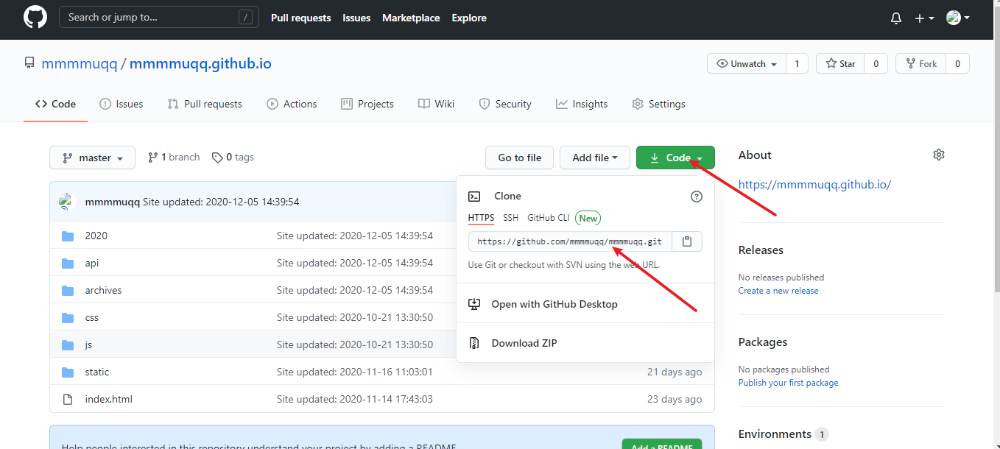
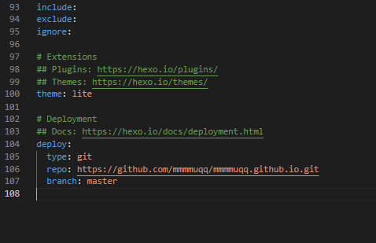

# 
Hexo框架三个步骤

## 
1.环境搭建

### 1.1、安装nodejs，下载网址: https://nodejs.org/en/
选择左侧稳定版本。
键盘快捷键 win+R 输入 cmd 打开命令行，输入 node -v 测试是否安装成功。

  <!-- more -->
### 1.2、安装Hexo框架
在刚才的命令行输入 npm install -g hexo -cli
表示全局安装 hexo -cli脚手架。
命令行输入 hexo -v 测试是否安装成功。

### 1.3、安装git，下载网址：https://git-scm.com/
安装 git for windows ，2020/11/14 此刻的版本是 2.29.2。
命令行输入 git –version 测试是否安装成功。
ps：在官网上下载下的很慢可以用国内的镜像下载
https://npm.taobao.org/mirrors/git-for-windows/

## 
2.使用Hexo开始搭建博客

### 2.1、创建新的文件夹
创建新的文件夹(笔者取名为blog)
并在该目录下打开命令行工具。(进入到该目录下按住shifit右击鼠标，在此处打开powershell窗口)
也可以启动命令行，cd 绝对路径 到达该目录。（cd D:/blog）
后续的操作都在blog此目录下完成。

### 2.2、通过hexo命令初始化博客
输入 hexo init
这一步很慢，当出现提示 start blogging with Hexo! 即初始化完成。
blog该文件夹内就生成了项目文件
这时候我们可以继续运行命令 hexo s
出现一个访问地址、点击即可预览。（必须要联网）
命令行按 ctrl+c 即可结束该服务。

### 2.3、如果此时想更新博客需要依次执行几个命令
hexo clean 清理缓存
hexo g 解析生成
hexo s 在本地运行你的hexo项目
hexo s 后在浏览器输入`http://localhost:4000`即可访问到你的hexo项目了

## 
3.将博客部署到github

### 3.1、ssh配置
部署得要一个giuhbu得账号自己注册去
打开git 

输入
git config --global user.name "mmmmuqq"
git config --global user.name "github的用户名"

git config --global user.email "1564006443@qq.com"
git config --global user.email "github的邮箱地址"

ssh-keygen -t rsa -C "1564006443@qq.com"
ssh-keygen -t rsa -c "github的注册邮箱地址"
按三次回车

生成ssh
查看是否已经有了ssh密钥：`cd ~/.ssh`
生成的密钥在c盘的用户文件夹里面的.ssh里面
ssh生成后得到了三个个文件：id_rsa id_rsa.pub 
用记事本打开 id_rsa.pub 复制内容

登陆github 进入设置 配置ssh

### 3.2、创建仓库
登陆github创建仓库，注意仓库名以你的 ID名称 比如 id zhangsan 仓库名：zhangsan.github.io

### 3.3、在本地项目中安装git部署插件
还是blog目录下打开命令行，输入： npm install –save hexo-deployer-git

### 3.4、修改配置文件
笔者用的是vscode vscode天下第一
命令行输入 code. 用vsc打开
修改blog目录下的配置文件 _config.yml
翻到最下边按如下更改：
deploy：
type： ‘git’
repo： github上创建的仓库地址
branch：master

### 3.5、部署到github
blog目录打开命令行输入：hexo d
提示输入github上的账号密码将代码提交到github仓库就行了
最后通过github的链接也就是仓库名就可以访问博客了。

https://mmmmuqq.github.io/#/
## 
 4.新建一篇博客 

在命令行里输入 `hexo new myblog`会生成一个source文件夹里面markdown文件然后你就可以在这个md文件里写博客了
很简单的拉