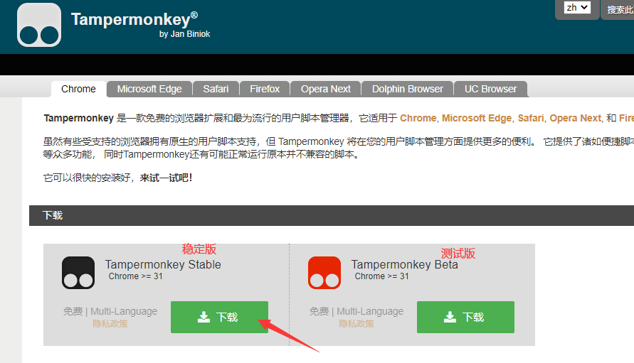
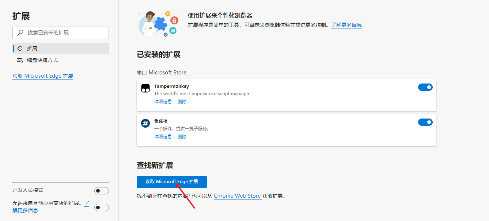
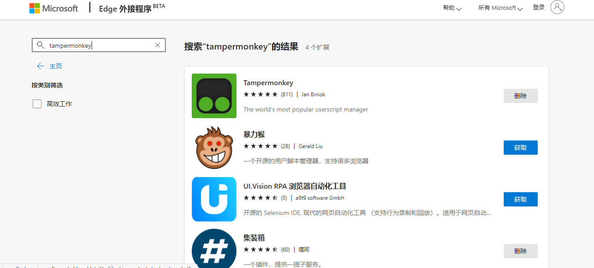
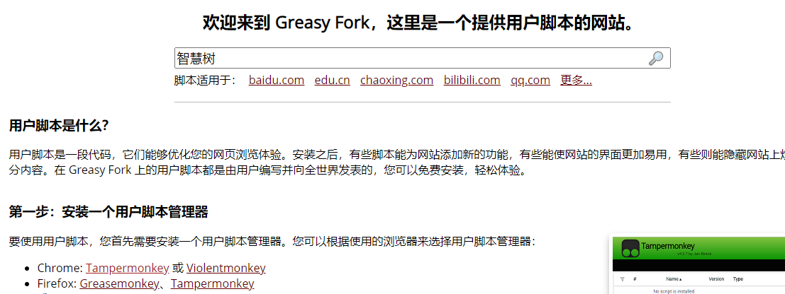
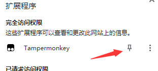

#  
 1.安装扩展程序 

## 
 chrome的安装 

打开 <a href="https://www.tampermonkey.net/" target="_blank">Tampermonkey.net </a> 官网，安装对应版本的插件。
这里我们下载稳定版本
 <!-- more -->

ps：要在这个网站下载的话需要科学上网。
不会科学上网的话插件我已经给你准备好了。  <a href="https://wwa.lanzous.com/i7tNJig48md" target="_blank"> https://wwa.lanzous.com/i7tNJig48md </a>
下载好了之后，手动将 crx 文件拖动至扩展页面安装即可。
用的chrome话可以通过网站 <a href="https://www.crx4chrome.com/" target="_blank"> crx4chrome </a> 来下载各种扩展程序 crx 文件。
 ##  
 edge的安装 

 相对来说edga的安装插件就非常简单了。不同于谷歌这个小公司edge我们可以用它的扩展商店直接无脑安装插件。
 打开edge浏览器右上角那三个点点，打开扩展界面。
 
 搜索Tampermonkey下载就行了。

 都图文并茂了再不会的就去死把。

#  
 2.下载脚本 

进入提供用户脚本的<a href="https://greasyfork.org/zh-CN" target="_blank">网站 </a>。
https://greasyfork.org/zh-CN
搜索智慧树

我用的是这个

安装完后固定扩展程序，这样可以更清楚的看到脚本是否在运行

 # 
 3.开始刷课 

 登陆智慧树，进入找到你要刷的课程
 然后你就会看到右上角有个小红点亮了起来（其实登陆了智慧树他就有了）
 
 只要不出意外你去睡一觉你的网课就完成
 嗯 这就是意外
 

